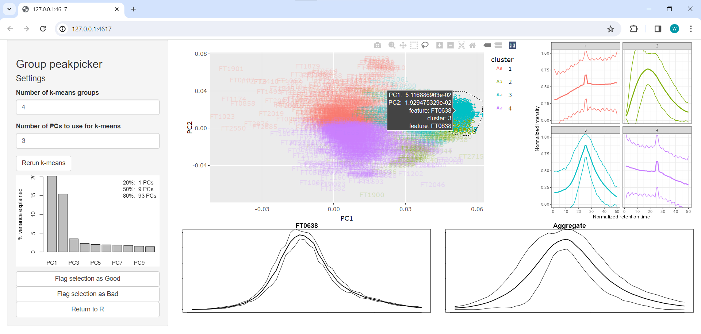
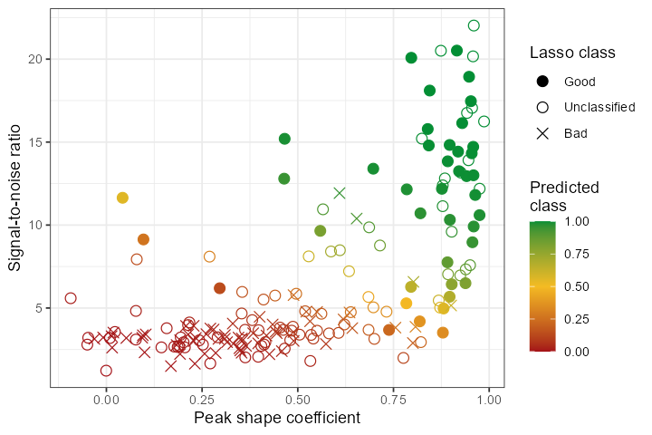

# Speedy quality assurance via lasso labeling for untargeted MS data (squallms)

## Overview

`squallms` is a Bioconductor R package that implements a "semi-labeled" approach to untargeted mass spectrometry data. It pulls in raw data from mass-spec files to calculate several metrics that are then used to label MS features in bulk as high or low quality that are then passed to a simple logistic model that produces a fully-labeled dataset suitable for downstream analysis. 

### Step 0: Installation

`squallms` isn't yet on Bioconductor, so the easiest way to install it is directly from Github with the `remotes` package. This section will be updated once it's on Bioconductor properly.

```
remotes::install_github("https://github.com/wkumler/squallms")
```

Once installed, `squallms` can be loaded like any other package:

```
library(squallms)
```

### Step 1: Metric extraction

`squallms` obtains peak quality metrics in two ways. First, it compares individual MS features to an idealized bell shape as detailed in [Kumler et al. 2023](https://doi.org/10.1186/s12859-023-05533-4) (figure below) to extract the beta_cor and beta_snr metrics. Second, it constructs a retention time by filename by normalized intensity matrix and performs a PCA to extract the dominant feature signal - typically also a bell curve represented in the first or second principal components. The PCs are used to group together similar features for rapid annotation in Step 2, while the beta_cor and beta_snr metrics are used alongside the labels to construct the logistic model in Step 3 below.


### Step 2: Labeling

Two labeling tools are provided for rapid MS feature classification. The first renders each feature as a chromatogram and accepts keybound inputs to assign classes to the feature. The second uses the PCA coordinates extracted in Step 1 to place features in a similarity space and triggers a small Shiny app to label clusters of compounds using the "lasso" tool. Both tools produce a two-column data frame of feature and classification used to train the logistic model detailed in Step 3.

Built-in Shiny app for simultaneous lasso labeling of similar features:


### Step 3: Logistic modeling

After metrics have been extracted and labeling has occurred, a logistic model can be trained to predict MS feature class from the beta_cor and beta_snr values obtained in Step 1 (and additional metrics supplied by the user). This model returns the estimated likelihood of each peak being classified as "Good" or "Bad" which can then be used to remove features that fall below a given likelihood threshold. 

Distribution of model predictions relative to lasso labels:


## Demo:

```
library(tidyverse)
library(xcms)
library(MSnbase)
library(RaMS)

# remotes::install_github("https://github.com/wkumler/squallms")
library(squallms)

mzML_files <- list.files(system.file("extdata", package = "RaMS"), full.names=TRUE)[c(3,5,6)]

register(BPPARAM = SerialParam(progressbar = TRUE))
msnexp_filled <- readMSData(files = mzML_files, msLevel. = 1, mode = "onDisk") %>%
  findChromPeaks(CentWaveParam(snthresh = 0)) %>%
  adjustRtime(ObiwarpParam(binSize = 0.1, response = 1, distFun = "cor_opt")) %>%
  groupChromPeaks(PeakDensityParam(sampleGroups = 1:3, bw = 12, minFraction = 0, 
                                   binSize = 0.001, minSamples = 0)) %>%
  fillChromPeaks(FillChromPeaksParam(ppm = 5))

msdata <- grabMSdata(mzML_files, grab_what = "MS1")
peak_data <- makeXcmsObjFlat(msnexp_filled)
feat_metrics <- extractChromMetrics(peak_data, recalc_betas = TRUE, verbosity = 2, 
                                    ms1_data = msdata$MS1)
class_labels <- labelFeatsLasso(peak_data, ms1_data=msdata$MS1, verbosity=1)
cleaned_xcms_obj <- updateXcmsObjFeats(msnexp_filled, feat_metrics, class_labels,
                                       likelihood_threshold=0.5, verbosity=2)
```
