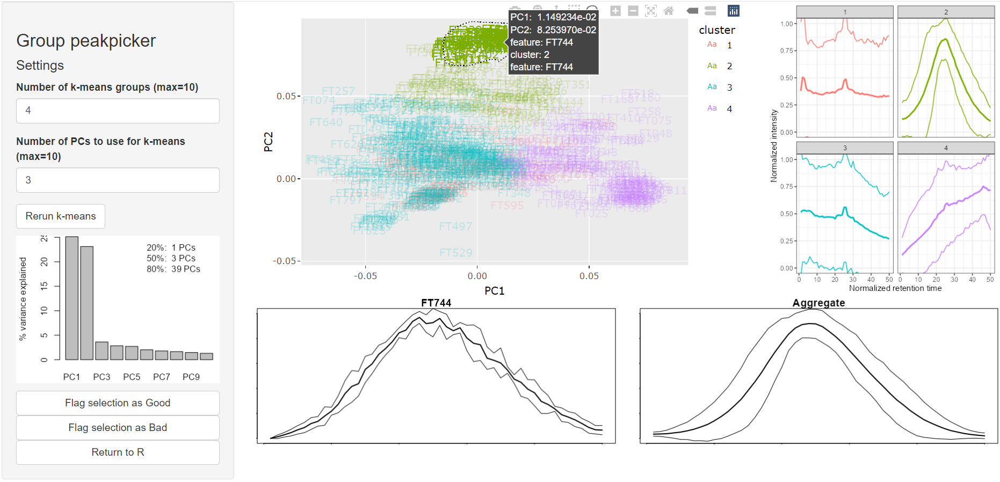

# Summary

Distinguishing between high and low quality mass features remains a major bottleneck in untargeted mass spectrometry. Here, we present the R package squallms that streamlines the process of chromatographic feature annotation by extracting useful metrics from the raw data, labeling groups of similar features interactively, and building a logistic classification model. The package is available via Bioconductor (https://bioconductor.org/packages/release/bioc/html/squallms.html, [@DOI]) and interfaces with other mass spectrometry packages there such as XCMS [@Smith2006]. We expect this functionality to significantly reduce the effort required to explore and curate increasingly common large-scale chromatography-based mass spectrometry datasets.

# Statement of need

Chromatographic mass spectrometry is a powerful way to characterize the molecular composition of chemical and biological samples. The development of data-driven algorithms for untargeted mass spectrometry has massively increased the amount of information obtainable from these datasets, but these algorithms are still plagued by false positive (noise) features [@Gika2019; @Pirttila2022; @Gloaguen2022]. Though novel metrics are actively being developed to quantify the quality of features extracted by untargeted software [@Kantz2019; @Kumler2023], they are difficult to translate across datasets due to differences in instrument setup and sensitivity. Additionally, removing features via sequential thresholding fails to make use of the multivariate advantage and requires the use of thresholds set rather arbitrarily by the user [@Olivieri2008].

A potential alternative is the use of a multivariate logistic model for the annotation of chromatographic feature quality. However, creating labeled datasets for training such models is often dull and time consuming because it requires the manual review of many individual chromatograms by an expert. Instead, we propose that many similar features can be annotated simultaneously if organized in such a way that an expert can denote an entire group of features as good or bad with a single interaction. These annotations can then be used to train a logistic regression model so that an entire dataset can be quality annotated with confidence quickly and easily [@Kantz2019].

# Dimensionality reduction as a feature grouping method

High-quality chromatographic features share a common trait: a bell-shaped peak of high intensity near the center of the feature with low intensity regions to each side that's repeated across multiple samples in the dataset. This commonality led us to believe that a principal component analysis (PCA) would result in a separation between noise features and true signals. To perform a PCA on multi-file chromatographic data, we linearly interpolated the intensity signals to a shared set of retention time values and treated each combination of file and retention time as a dimension in the PCA (\autoref{fig:EIC}). 

We then viewed the distribution of features in the first two principal components and found that features with visually similar chromatography were located in a tight cluster while noise features were scattered randomly near the center of the principal component space, as expected (\autoref{fig:PCA}).

![Subset of chromatographic features shown both individually in top down view and in principal component space. The upper plot shows eighteen chromatographic features and their associated ID beginning with the letters FT. Features 134, 137, 138, 141, and 144 all appear to be high quality and look very similar with a bright green central stripe and dark purple edges. The two final small multiples (PC1 and PC2) show the first and second principal components for comparison. The lower plot shows how the eighteen features fall in principal component space, with the five high-quality features noted above all clustering to the left side of the plot, separately from the other features.\label{fig:PCA}](joss_fig2.png)

# Implementation as an interactive application in squallms

While the demonstration above clearly separates high-quality features from low-quality features along the first principal component because quality is the largest source of variance in this data, this is not guaranteed to be the case. In datasets where inter-sample variability is high or many features have an increasing or decreasing baseline, the first principal component may become a combination of quality and these other factors. This necessitated the development of an interactive method for the identification of the region where high-quality features predominate.

We developed the squallms R package to enable this kind of interactive feature selection and model construction. The package is designed to iterate through three distinct steps of feature quality annotation: metric extraction, interactive labeling, and model training plus application. 

## Metric extraction

Metric extraction consists of extracting the raw MS data associated with each chromatographic feature and the calculation of various quality metrics that may serve to distinguish good features from bad. This step is not necessary if the input data already contain calculated metrics but implements two reasonably robust measures of peak quality [@Kumler2023] and provides a scaffolding for additional implementation from the user. Importantly, recalculation of quality metrics must be done on data without retention time correction since the raw data is read in from the mzML/mzXML files. Alternatively, functions from the RaMS package [@Kumler2022] can be used to edit the retention times of the mzML/mzXML files to reflect the applied correction.

## Interactive labeling

Chromatographic feature labeling can be performed before or after metric extraction because it does not depend on the information from the extraction step but instead displays MS features for annotation. The core function here triggers a Shiny application with Plotly functionality to accept user selection via the lasso or rectangular select tools [@Chang2024; @Sievert2020]. The main interface is shown below in \autoref{fig:ss} for all features, not just the subset used in the demo above.

The central plot is an interactive version of the principal component plot shown in \autoref{fig:PCA}. Upon mouse hover, individual features are rendered in the lower left panel for rapid overview and detection of high quality regions. Clicking and dragging on this central plot will begin selecting features that can be labeled as either "Good" or "Bad" using the buttons at the bottom of the settings panel at the far left. Selected features are also shown in aggregate in the lower right panel as the median normalized intensity plus its interquartile range. Colors in this central plot correspond to clusters assigned via k-means algorithm and provide a way to use information from principal components beyond the first two, as clusters can be hidden by double-clicking on the associated legend entry. Multiple selections can be made for both good and bad annotations. Once the user is satisfied with the labeling they've done, they can either close the window or click the "Return to R" button in the settings panel to create an R object in the existing session containing the labels and their associated feature ID.

The squallms package also provides a manual labeling tool that uses a separate Shiny application to render individual chromatograms and detects keyboard input to categorize features. This functionality can either be used to produce a more reliable set of training data for the downstream model or to check the quality of the lasso annotation method.

## Model training and application

The final step brings together the extracted quality metrics with the user's manual annotations to construct a multivariate logistic regression model. The manual annotations are used to fit the model which is then applied to all features in the dataset. The model estimates can be approximately interpreted as the likelihood that a given feature would be removed during the process of manual quality review that requires reviewing all peaks one at a time. This single threshold allows the user to implement variable levels of quality control, from a lax threshold of perhaps 1-10% during an exploratory analysis to 99% or more for stricter control of the false positive rate.

# Acknowledgements

This work was supported by the University of Washington eScience Institute through their Data Science Incubator program. We would like to thank Bryna Hazelton and Valentina Staneva in particular for thoughtful discussion on algorithm design and package development. Funding was provided by the Simons Foundation (SCOPE Award ID 329108 to AEI, SF Award ID 385428 to AEI).

# References

