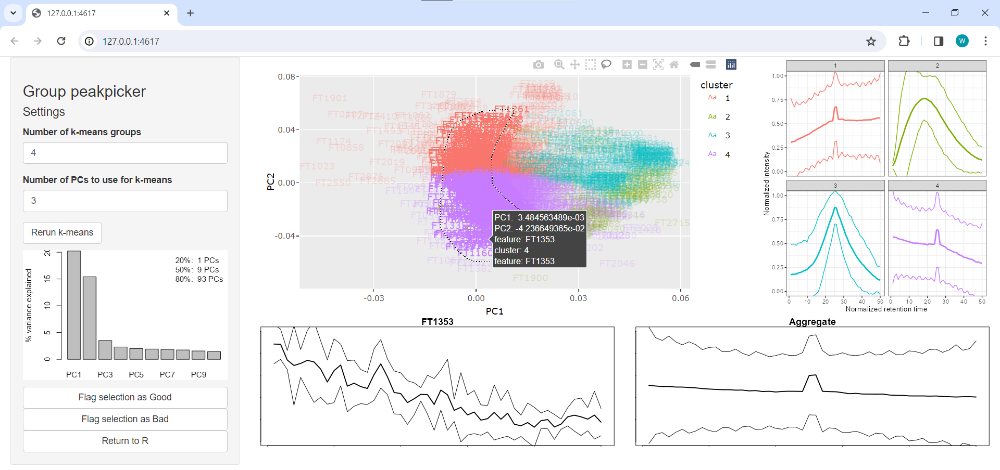

```{r, include = FALSE}
knitr::opts_chunk$set(
    collapse = TRUE,
    comment = "#>",
    crop = NULL
)
```

`squallms` is a Bioconductor package designed to easily label and remove low-quality chromatographic features from LC/GC-MS analysis. It does this by calculating a few metrics of peak quality from the raw MS data, providing methods for grouping similar peaks together and labeling them, and editing XCMS objects so only the high-quality peaks remain.

# Setup

## Installation

`squallms` can be installed from Bioconductor (from release 3.19 onwards): 

```{r install_demo, eval=FALSE}
if (!require("BiocManager", quietly = TRUE)) install.packages("BiocManager")

BiocManager::install("squallms")
```

`squallms` makes extensive use of the tidyverse for data shaping and organization as well as the `RaMS` package for MS data extraction. It also uses the `shiny` and `plotly` packages for interactive data visualization.

```{r library_squallms, message=FALSE}
library(squallms)
```

# Introduction

Mass-spectrometry coupled to chromatographic separation is a powerful technique for the discovery and quantification of molecules. Recent developments in automated peakpicking software have made it possible to query an entire dataset for molecular features that appear in the data as "peaks", but these algorithms continue to have unacceptably high false positive rates that require manual review of their performance. Thus, a method for streamlining peak quality annotation in a robust and efficient way is very much in demand. This software package attempts to bridge this gap with a set of tools for the calculation of peak quality metrics and the rapid and interactive labeling of peak lists.

This package leans heavily on existing resources. Input files are required to be mzML/mzXML, mandating the use of Proteowizard's `msconvert` or other software to convert proprietary formats into these open-source versions. This package also performs no peakpicking, retention time correction, or correspondence of its own, requiring the use of XCMS, MzMine, MSDIAL, or other software for the extraction of a preliminary peak list. However, the package has been designed to augment these existing resources (in particular XCMS) by accepting multiple input formats for peak lists that are shared across various systems.

At its core, this package takes in a peak list (a data frame containing columns for sample id and feature id) and returns one with only high-quality peaks. It does this by calculating a few metrics of peak quality from the raw MS data, providing methods for rapid feature viewing and labeling, and constructing a logistic model to label any remaining features. These steps are reviewed in detail with associated code entries in the rest of this vignette below.


## Peakpicking with XCMS

This demo uses data peakpicked with XCMS but it's worth noting that any peakpicking software could be used to produce a peak list as long as it can be turned into the proper input format (see "Calculating metrics of peak quality" below). The data files used here for demonstrationg purposes are those provided with the RaMS package.

```{r run_xcms, message=FALSE}
suppressPackageStartupMessages({
    library(dplyr)
    library(tidyr)
    library(tibble)
    library(ggplot2)
    library(xcms)
    library(RaMS)
})
mzML_files <- system.file("extdata", package = "RaMS") %>%
    list.files(full.names = TRUE, pattern = "[A-F].mzML")

register(BPPARAM = SerialParam())
cwp <- CentWaveParam(snthresh = 0, extendLengthMSW = TRUE, integrate = 2)
obp <- ObiwarpParam(binSize = 0.1, response = 1, distFun = "cor_opt")
pdp <- PeakDensityParam(
    sampleGroups = 1:3, bw = 12, minFraction = 0,
    binSize = 0.001, minSamples = 0
)


xcms_major_version <- as.numeric(substr(as.character(packageVersion("xcms")), 1, 1))
if(xcms_major_version>=4){
    library(MSnbase)
    msexp <- readMSData(mzML_files, msLevel. = 1, mode = "onDisk")
    fpp <- FillChromPeaksParam(ppm = 5)
} else {
    library(MsExperiment)
    msexp <- readMsExperiment(mzML_files, msLevel. = 1, mode = "onDisk")
    fpp <- ChromPeakAreaParam()
}

xcms_filled <- msexp %>%
    findChromPeaks(cwp) %>%
    adjustRtime(obp) %>%
    groupChromPeaks(pdp) %>%
    fillChromPeaks(fpp)
```

This XCMS object is useful for documenting processing steps and interfacing with R-based pipelines but can be challenging to inspect and interact with. `squallms` provides a function that turns this S4 object into a flat file containing the feature and peak information.

```{r makeXcmsObjFlat}
feat_peak_info <- makeXcmsObjFlat(xcms_filled) %>%
    select(feature, starts_with("mz"), starts_with("rt"), filename, filepath)
feat_peak_info %>%
    head() %>%
    mutate(filepath = paste0(substr(filepath, 1, 13), "~")) %>%
    knitr::kable()
```

Although comprehensive, the only information needed is actually the grouping info, the peak bounding boxes, and the filepath (feature, mz\*, rt\*, and filepath) because we'll recalculate the necessary metrics from the raw peak data pulled in from the mz(X)ML files. Similarly, other peakpicking algorithms tend to produce data in a similar format and can interface with `squallms` here.

We also can operate over only a *subset* of the data, which is quite useful for very large datasets. Quality control files or pooled samples with a similar expected quality can be used in lieu of the entire dataset which may not fit into computer memory. The chunk of code below shows a possible way to do this using the `dplyr` package's `filter` command to keep only two of the files, dropping a third from the quality calculations.

```{r pooled_files_only}
feat_peak_info_subset <- feat_peak_info %>%
    filter(grepl("AB|CD", filename))
```

Note, however, that the **retention time bounds must be uncorrected**. `makeXcmsObjFlat` does this automatically for XCMS objects, but if corrected retention times are provided then the data extracted from the mz(X)ML files will be incorrect.

# Calculating metrics of peak quality (extractChromMetrics)

The first step is to obtain some kind of information about the chromatographic features that will allow us to distinguish between good and bad. The most intuitive metrics (in my opinion) are similarity to a bell curve and the signal-to-noise ratio. Although many implementations of these exist, the ones I've found most useful are described in [Kumler et al. (2023)](https://doi.org/10.1186/s12859-023-05533-4). The function for this in `squallms` is `extractChromMetrics`, as shown below. I read in the raw MS data with RaMS first because this saves a step and can be reused for quality checks.

```{r extractChromMetrics, warning=FALSE}
msdata <- grabMSdata(unique(feat_peak_info$filepath), verbosity = 0)
shape_metrics <- extractChromMetrics(feat_peak_info, ms1_data = msdata$MS1)
knitr::kable(head(shape_metrics))
shape_metrics %>%
    arrange(desc(med_snr)) %>%
    ggplot() +
    geom_point(aes(x = med_rt, y = med_mz, color = med_cor, size = med_snr), alpha = 0.5) +
    theme_bw()
```

The output from `extractChromMetrics` is a data frame with peak shape (med_cor) and signal-to-noise (med_snr) calculations as estimated for each feature in the dataset. Unfortunately, many of these features are very low-quality, often a result of noise rather than biological signal, and should not be included in the downstream analysis. We view a random subset of the features that XCMS produced in the below code chunk:

```{r plotrandompeaks}
# Set seed for reproducibility, ensuring that slice_sample always returns the
# same features for discussion below.
set.seed(123)

some_random_feats <- shape_metrics %>%
    slice_sample(n = 8)
some_random_feats %>%
    mutate(mzmin = med_mz - med_mz * 5 / 1e6) %>%
    mutate(mzmax = med_mz + med_mz * 5 / 1e6) %>%
    mutate(rtmin = med_rt - 1) %>%
    mutate(rtmax = med_rt + 1) %>%
    left_join(msdata$MS1, join_by(
        between(y$rt, x$rtmin, x$rtmax),
        between(y$mz, x$mzmin, x$mzmax)
    )) %>%
    qplotMS1data(color_col = "med_cor") +
    geom_vline(aes(xintercept = med_rt), color = "red") +
    geom_text(aes(x=Inf, y=Inf, label=paste0("SNR: ", round(med_snr))), 
               data=some_random_feats, hjust=1, vjust=1, color="black") +
    facet_wrap(~feature, scales = "free", nrow = 3) +
    scale_color_continuous(limits=c(0, 1), name="Peak shape metric") +
    scale_y_continuous(expand = expansion(c(0, 0.25))) +
    theme(legend.position=c(0.82, 0.12)) +
    guides(color=guide_colorbar(direction = "horizontal", title.position="top"))
```

As expected, many "noise" signals were picked up, even in this precleaned demo dataset. Fortunately, it also looks like our peak quality metrics are doing a reasonable job of distinguishing features that look ok (e.g. FT014, FT179) from those of poor quality (e.g. FT118, FT050) with lower values for med_cor and med_snr in the noisy features.

However, each MS setup, dataset, and analyst will have their own tolerance for peak quality, making it difficult to provide universal recommendations for thresholds at which med_cor and med_snr should be used to filter out poor-quality features. This means that some degree of manual review and labeling is likely always going to be necessary for a high-quality dataset.

# Labeling

Labeling chromatographic features is usually a slow and painful step. XCMS's methods for extracting chromatograms are sluggish and difficult to customize, while data entry usually involves having an Excel workbook or some similar data entry object open to record the values. `squallms` provides two ways of labeling features a little more easily.

## Manual labeling with labelFeatsManual

`labelFeatsManual` accepts the data frame of peak information constructed above and renders one random feature at a time in a new plotting window. This plot window then detects when arrow keys are pressed which have been bound to specific classifications. Currently, the left arrow key categorizes the feature as "Bad" while the right arrow key categorizes it as "Good". The up arrow key also classifies it as "Revisit" for later analysis. Once pressed, a new window pops up with a new random feature. The backspace button can also be used to revisit the previous peak in case of accidental or incorrect assignment. This process repeats until the Escape key is pressed or there are no features left to label. Alternatively, this function can be used to double-check existing classifications if the `existing_labels` argument is provided and the selection is set to "Labeled" (see below).

```{r labelFeatsManual, eval=FALSE}
manual_classes <- labelFeatsManual(feat_peak_info, ms1_data = msdata$MS1)
```

The plot that's shown for each feature looks like the one below, with the feature ID and median *m/z* value shown in the title while the typical chromatogram is produced as a line plot of intensity plotted against retention time.

```{r plotManualFeatWindow}
row_data <- feat_peak_info %>%
    group_by(feature) %>%
    summarise(mzmed = median(mz), rtmed = median(rt)) %>%
    filter(feature == "FT001")
mzbounds <- pmppm(row_data$mzmed, 10)
rtbounds <- row_data$rtmed + c(-1, 1)
eic <- msdata$MS1[mz %between% mzbounds][rt %between% rtbounds] %>% arrange(filename, rt)

plot(eic$rt, eic$int, type = "l", ylab = "Intensity", xlab = "Retention time")
abline(v = row_data$rtmed, col="red")
title(paste(row_data$feature, round(mzbounds[1], 7)))
```

This first peak looks reasonably good, so I would assign this a "Good" classification with a right-arrow key press.

The `labelFeatsManual` function returns a vector containing the assigned quality assessments, with NAs for each feature that wasn't labeled. An example of this output can be found included in the package for demonstration purposes and is loaded here for use in the rest of the vignette.

```{r load_prior_manual_labels}
manual_classes <- readRDS(system.file("extdata", "intro_manual_labels.rds", package = "squallms"))
table(manual_classes, useNA="ifany")
```

## Lasso labeling with labelFeatsLasso

However, one of the big strengths of `squallms` is its implementation of a strategy for classifying many peaks simultaneously. To do this, the raw MS data for a multi-file feature is coerced to a set of shared retention times. This RT x file peak matrix can then be treated as individual "pixels" in a PCA that extracts the major patterns. For chromatographic peak data, the dominant signal is often noise vs real peak. This operation is performed using the `pickyPCA` function of the package, though for non-demonstration purposes it's usually not necessary to call it directly as it's performed within the `labelFeatsLasso` function. Here, we call `pickyPCA` with a small subset of 20 features to visually demonstrate the logic.

```{r pcaoutput creation}
pcaoutput <- feat_peak_info %>%
    filter(feature %in% sprintf("FT%03d", 30:50)) %>%
    pickyPCA(
        ms1_data = msdata$MS1, rt_window_width = 1, ppm_window_width = 5,
        verbosity = 0
    )
```

The similarity between high-quality peaks can be seen visually in the figure below. Good peaks have a distinctly lighter center and darker sides corresponding to high values at the center of the peak and low values at the edges of the window. The pattern's visible across multiple files as a ridge running vertically down each feature's small multiple plot. In this case, features FT030, FT040, FT041, and FT044 look like high-quality features. Noise features have no obvious pattern, so the PCA won't be able to extract signal from them as a dominant component. The other pattern are the features (FT031, FT042, FT048) that are intense at the beginning or at the end, corresponding to the noise peaks that CentWave loves picking out so much.

```{r pixel matrix ggplot}
pcaoutput$interp_df %>%
    ggplot() +
    geom_tile(aes(x = approx_rt, y = filename, fill = approx_int)) +
    facet_wrap(~feature, nrow = 4) +
    scale_x_continuous(
        breaks = c(1, 25, 50), labels = c("0", "0.5", "1"),
        expand = expansion()
    ) +
    scale_y_discrete(expand = expansion()) +
    theme(
        axis.text = element_blank(), axis.ticks = element_blank(),
        legend.position = "none"
    ) +
    labs(x = "Scaled retention time", y = "Individual files")
```

When the PCA is performed, we then see these features separated from the rest along the first principal component, with features FT030, FT040, FT041, and FT044 all stacking almost on top of each other at the far right side of the principal component plot.

```{r principal component plot}
pcaoutput$pcamat %>%
    prcomp() %>%
    .$rotation %>%
    .[, 1:2] %>%
    as.data.frame() %>%
    rownames_to_column("feature") %>%
    ggplot(aes(x = PC1, y = PC2, label = feature, key = feature)) +
    geom_vline(xintercept = 0) +
    geom_hline(yintercept = 0) +
    geom_text() +
    coord_fixed() +
    scale_x_continuous(expand = expansion(0.2)) +
    labs(x = "Principal component 1", y = "Principal component 2") +
    theme_bw()
```

Of course, such separation isn't guaranteed to be consistently to the left or right and isn't always neatly along one axis. While a line between good and bad could be drawn with complicated math expressions, a much easier way is to simply engage an interactive visualization allowing for arbitrary selection. R's `shiny` and `plotly` packages are perfect for this method, so `squallms` has a built-in Shiny application that launches in the browser and can be used to select such peaks using the "lasso" tool - thus, the "lasso labeling" part of the package name.

```{r labelFeatsLasso, eval=FALSE}
lasso_classes <- labelFeatsLasso(feat_peak_info, ms1_data = msdata$MS1)
```

In the screenshot below, I've moused over the feature IDs in the central plot as they render one at a time in the bottom left. Once I find a cluster where many high-quality features are found, I clicked and dragged to select a region of good features, which rendered the "aggregate" feature in the bottom right. Shortly after, I clicked the "Flag selection as Good" at the bottom of the left sidebar.


Of course, a training set needs examples of low-quality peaks as well. I then browsed other features in the central plot until finding a region of low-quality features that I could similarly select using the lasso tool and flag as Bad. Multiple regions can be selected and combined with additional lassos, and of course the rectangle selection tool can be used instead of the freehand.



In this case, the good/bad signal was so strongly dominant that I had no need for additional principal components and really only needed the first one to capture my internal sense of peak quality. However, other datasets may not identify the quality signal as the first or even second PC, especially if there's a large biological signal present. To handle this case, I added a k-means clustering algorithm that operates on all PCs and renders their aggregate shape in the upper right. Combined with plotly's ability to show or hide individual clusters by double-clicking the plot legend, this allows the user to isolate regions in multidimensional space while still only showing the first two PCs in the plot. Both k and the number of PCs used for the k-means clustering can be set in the left sidebar, while a simple barplot provides information about the number of PCs that capture 20, 50, and 80% of the variation in the dataset.

While both the number of clusters and the number of PCs used are arbitrary, the idea is that these provide a way to capture variation beyond the first two principal componenents if the initial distribution is unhelpful. I would recommend increasing the number of PCs used to capture 50+% of the variation, while the number of clusters can be toggled until the groups in the aggregate plots in the upper right look good and an entire cluster can be grabbed at one time.

After both good and bad features have been flagged, clicking the "Return to R" button at the bottom of the sidebar or closing the window will return a character vector consisting of "Good", "Bad", and NAs named by the feature with which those labels were associated. As before, I saved the output from a previous session on the demo data using the lassos shown in the screenshots above and have provided it alongside for demonstration purposes.

```{r load_prior_lasso_labels}
lasso_classes <- readRDS(system.file("extdata", "intro_lasso_labels.rds", package = "squallms"))
table(lasso_classes, useNA="ifany")
```

If you're unsure how well the lasso performed, you can easily pass this vector back to the manual labeling tool with `selection = "Labeled"` to double-check on the agreement between the lasso and the manual methods.

```{r manual_relabel_lasso, eval=FALSE}
manual_classes <- labelFeatsManual(feat_peak_info, ms1_data = msdata$MS1, selection = "Labeled", existing_labels = lasso_classes)
```

This comparison between the lasso labels and the manual labels allows us to estimate the robustness of our labeling using typical metrics such as false positive/negative rates as well as accuracy and F1 scores, all provided concisely by the `caret` package.

```{r caret_confusion}
suppressPackageStartupMessages(library(caret))
data.frame(manual = manual_classes, lasso = lasso_classes) %>%
    filter(!is.na(manual) & !is.na(lasso))

data.frame(manual = factor(manual_classes), lasso = factor(lasso_classes)) %>%
    filter(!is.na(manual)) %>%
    with(confusionMatrix(lasso, manual, positive = "Good"))
```

If there are differences between the two (the demo data happens to align perfectly), we can replace the lasso labels with the (generally) more reliable manual labels.

```{r update_existing}
class_labels <- lasso_classes
class_labels[!is.na(manual_classes)] <- manual_classes[!is.na(manual_classes)]
```

# Building a quality model and removing low-quality peaks

Of course, both labeling methods are designed to return partially-labeled datasets. To get quality estimates for the remaining features, we can use a logistic model trained on a few of our metrics to estimate the quality of each feature. The basic idea here is to use the `med_cor` and `med_snr` information extracted with `extractChromMetrics` as the predictive variables and the labels produced by `labelFeatsManual` or `labelFeatsLasso` as the predicted variable in a logistic regression. The default formula uses `glm(formula=feat_class~med_cor+med_snr, family = binomial)` to fit the values but additional metrics that exist in the `shape_metrics` data frame can be used as predictive variables in the model as well.

`logModelfeatProb` aligns the feature metrics with the labels and performs the logistic regression, returning a vector of likelihoods for every feature in the dataset, not just those that were previously labeled. These values range from 0 to 1 and estimate the probability that a given feature would be assigned a "Good" classification if manually reviewed, with values close to 1 being very likely to be "Good" and values close to 0 more likely to be low-quality.

```{r logModelFeatProb, warning=FALSE}
pred_probs <- logModelFeatProb(shape_metrics, class_labels)
```

The function also returns the diagram seen above when the `verbosity` argument is set to 2. This plot shows the med_cor and med_snr values calculated for each feature colored by their likelihood and shaped by their assigned class. Hopefully, a majority of the filled circles are green and the X shapes are red, with a clear diagonal through the center where features are of middling quality and there's a mix of good and bad features. This plot can be helpful in determining the probabilistic quality threshold above which features align with the user's intuition about acceptable peak quality.

The values returned by `logModelFeatProb` can then be handled manually, or you can use the wrapper function `logModelFeatQuality` with an associated `likelihood_threshold` to return the binary good/bad classification. This also then makes it possible to assess the performance of the model on the training data itself, so the `caret` package is again used here to provide accuracy metrics and a confusion matrix.

```{r logModelFeatQuality, warning=FALSE}
pred_classes <- logModelFeatQuality(shape_metrics, class_labels, verbosity = 1)
```

Finally, once an appropriate threshold has been set and the model's performance is acceptable the XCMS object itself can be edited to remove the poor-quality peaks. This function also notes `squallms` in the object's processing history (albeit poorly).

```{r updateXcmsObjFeats}
final_xcms <- updateXcmsObjFeats(xcms_filled, shape_metrics, class_labels,
    verbosity = 0, likelihood_threshold = 0.5
)
```

This final XCMS object can then be passed to downstream software with confidence!

# Vignette diagnostics

```{r}
sessionInfo()
```

Vignette last built on `r Sys.Date()`
