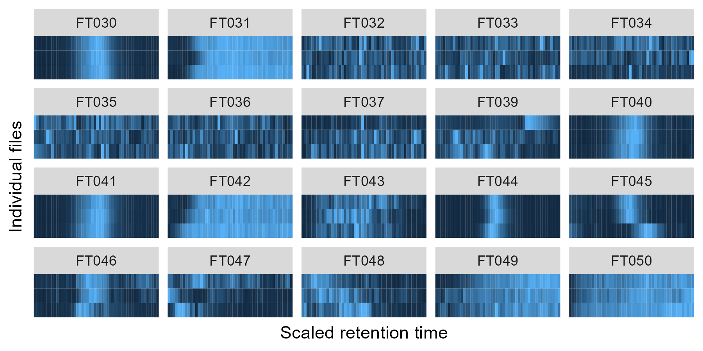
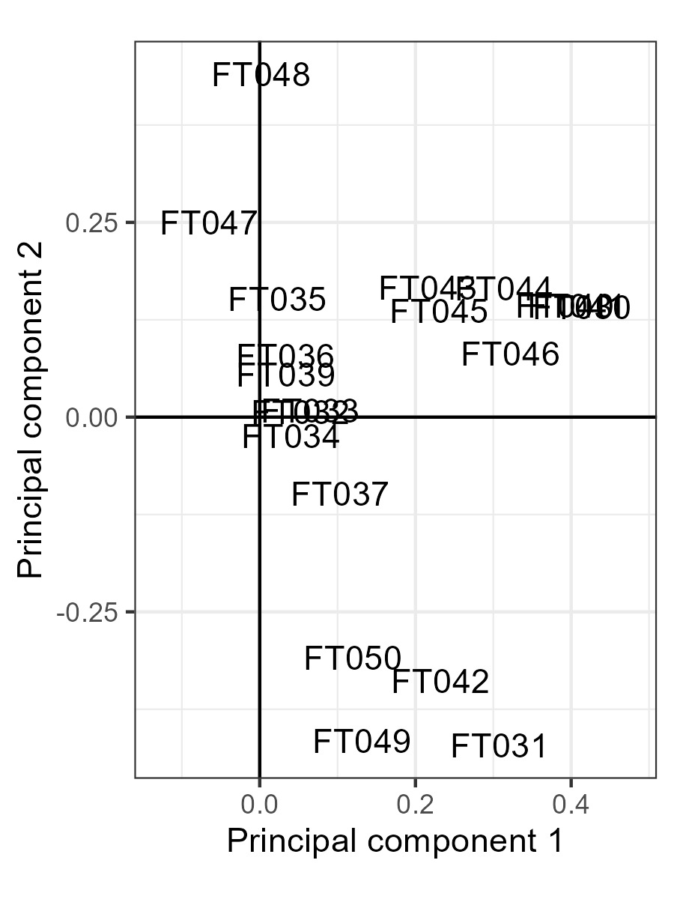

```{r, include = FALSE}
knitr::opts_chunk$set(
    collapse = TRUE,
    comment = "#>",
    crop = NULL
)
```

`squallms` is a Bioconductor package designed to easily label and remove low-quality chromatographic features from LC/GC-MS analysis. It does this by calculating a few metrics of peak quality from the raw MS data, providing methods for grouping similar peaks together and labeling them, and editing XCMS objects so only the high-quality peaks remain.

# Setup

## Installation

`squallms` can be installed from Bioconductor (from release 3.19 onwards): 

```{r install_demo, eval=FALSE}
if (!require("BiocManager", quietly = TRUE)) install.packages("BiocManager")

BiocManager::install("squallms")
```

`squallms` makes extensive use of the tidyverse for data shaping and organization as well as the `RaMS` package for MS data extraction. It also uses the `shiny` and `plotly` packages for interactive data visualization.

```{r library_squallms, message=FALSE}
library(squallms)
```

## Peakpicking with XCMS

For this demo, I'll be performing peakpicking with XCMS but it's worth noting that any peakpicking software could be used to produce a peak list as long as it can be turned into the proper input format (see "Calculating metrics of peak quality" below).

```{r run_xcms, message=FALSE}
suppressPackageStartupMessages({
    library(dplyr)
    library(tidyr)
    library(tibble)
    library(ggplot2)
    library(xcms)
    library(RaMS)
})
mzML_files <- system.file("extdata", package = "RaMS") %>%
    list.files(full.names = TRUE, pattern = "[A-F].mzML")

register(BPPARAM = SerialParam())
cwp <- CentWaveParam(snthresh = 0, extendLengthMSW = TRUE, integrate = 2)
obp <- ObiwarpParam(binSize = 0.1, response = 1, distFun = "cor_opt")
pdp <- PeakDensityParam(
    sampleGroups = 1:3, bw = 12, minFraction = 0,
    binSize = 0.001, minSamples = 0
)
xcms_filled <- mzML_files %>%
    readMSData(msLevel. = 1, mode = "onDisk") %>%
    findChromPeaks(cwp) %>%
    adjustRtime(obp) %>%
    groupChromPeaks(pdp) %>%
    fillChromPeaks(FillChromPeaksParam(ppm = 5))
```

```{r save_xcms_obj, eval=FALSE, echo=FALSE}
# saveRDS(xcms_filled, file="inst/extdata/intro_xcms_filled.rds")
```


This XCMS object is useful for documenting processing steps and interfacing with R-based pipelines but can be challenging to inspect and interact with. `squallms` provides a function that turns this S4 object into a flat file containing the feature and peak information.

```{r makeXcmsObjFlat}
feat_peak_info <- makeXcmsObjFlat(xcms_filled) %>%
    select(feature, starts_with("mz"), starts_with("rt"), filename, filepath)
feat_peak_info %>%
    mutate(filepath = paste0(substr(filepath, 1, 13), "~")) %>%
    head() %>%
    knitr::kable()
```

Although comprehensive, the only information needed is actually the grouping info, the peak bounding boxes, and the filepath (feature, mz\*, rt\*, and filepath) because we'll recalculate the necessary metrics from the raw peak data pulled in from the mz(X)ML files. Similarly, other peakpicking algorithms tend to produce data in a similar format and can interface with `squallms` here.

We also can operate over only a *subset* of the data, which is quite useful for very large datasets. Quality control files or pooled samples with a similar expected quality can be used in lieu of the entire dataset which may not fit into computer memory.

```{r pooled_files_only, eval=FALSE}
## Not run:
feat_peak_info <- feat_peak_info %>%
    filter(grepl("AB|CD", filename))
```

Note, however, that the **retention time bounds must be uncorrected**. `makeXcmsObjFlat` does this automatically for XCMS objects, but if corrected retention times are provided then the data extracted from the mz(X)ML files will be incorrect.

# Calculating metrics of peak quality (extractChromMetrics)

The first step is to obtain some kind of information about the chromatographic features that will allow us to distinguish between good and bad. The most intuitive metrics (in my opinion) are similarity to a bell curve and the signal-to-noise ratio. Although many implementations of these exist, the ones I've found most useful are described in a BMC Bioinformatics paper I put out in 2023. The function for this in `squallms` is `extractChromMetrics`, as shown below. I read in the raw MS data with RaMS first because this saves a step and can be reused for quality checks.

```{r extractChromMetrics, warning=FALSE}
msdata <- grabMSdata(unique(feat_peak_info$filepath), verbosity = 0)
shape_metrics <- extractChromMetrics(feat_peak_info, ms1_data = msdata$MS1)
knitr::kable(head(shape_metrics))
shape_metrics %>%
    arrange(desc(med_snr)) %>%
    ggplot() +
    geom_point(aes(x = med_rt, y = med_mz, color = med_cor, size = med_snr), alpha = 0.5) +
    theme_bw()
```

So far so good. Unfortunately, many of these features are very low-quality, often a result of noise rather than biological signal, and should not be included in the downstream analysis.

```{r plotrandompeaks}
set.seed(123)
shape_metrics %>%
    slice_sample(n = 8) %>%
    mutate(mzmin = med_mz - med_mz * 5 / 1e6) %>%
    mutate(mzmax = med_mz + med_mz * 5 / 1e6) %>%
    mutate(rtmin = med_rt - 1) %>%
    mutate(rtmax = med_rt + 1) %>%
    left_join(msdata$MS1, join_by(
        between(y$rt, x$rtmin, x$rtmax),
        between(y$mz, x$mzmin, x$mzmax)
    )) %>%
    qplotMS1data() +
    geom_vline(aes(xintercept = med_rt), color = "red") +
    facet_wrap(~feature, scales = "free", nrow = 2)
```


# Labeling

Labeling chromatographic features is usually a slow and painful step. XCMS's methods for extracting chromatograms are sluggish and difficult to customize, while data entry usually involves having an Excel workbook or some similar data entry object open to record the values. `squallms` provides two ways of labeling features a little more easily.

## Manual labeling with labelFeatsManual

`labelFeatsManual` accepts the data frame of peak information constructed above and renders one random feature at a time in a new plotting window. This plot window then detects when arrow keys are pressed which have been bound to specific classifications. Currently, the left arrow key categorizes the feature as "Bad" while the right arrow key categorizes it as "Good". The up arrow key also classifies it as "Revisit" for later analysis. Once pressed, a new window pops up with a new random feature. This process repeats until the Escape key is pressed or there are no features left to label.

```{r labelFeatsManual, eval=interactive()}
manual_classes <- labelFeatsManual(feat_peak_info, ms1_data = msdata$MS1)
```

```{r save_prior_demo_labels, eval=FALSE, echo=FALSE}
# saveRDS(manual_classes, "inst/extdata/intro_manual_labels.rds")
```

```{r load_prior_manual_labels, eval=!interactive(), echo=FALSE}
manual_classes <- readRDS(system.file("extdata", "intro_manual_labels.rds", package = "squallms"))
```

The classification plot looks like this:

```{r plotManualFeatWindow, echo=FALSE}
row_data <- feat_peak_info %>%
    group_by(feature) %>%
    summarise(mzmed = median(mz), rtmed = median(rt)) %>%
    filter(feature == "FT001")
mzbounds <- pmppm(row_data$mzmed, 10)
rtbounds <- row_data$rtmed + c(-1, 1)
eic <- msdata$MS1[mz %between% mzbounds][rt %between% rtbounds] %>% arrange(filename, rt)

plot(eic$rt, eic$int, type = "l", yaxt = "n", ylab = "", xlab = "Retention time")
abline(v = row_data$rtmed, col="red")
title(paste(row_data$feature, round(mzbounds[1], 7)))
```

Alternatively, this function can be used to double-check existing classifications if the `existing_labels` argument is provided and the selection is set to "Labeled" (see below).

## Lasso labeling with labelFeatsLasso

However, one of the big strengths of `squallms` is its implementation of a strategy for classifying many peaks simultaneously. To do this, the raw MS data for a multi-file feature is coerced to a set of shared retention times. This RT x file peak matrix can then be treated as individual "pixels" in a PCA that extracts the major patterns. For chromatographic peak data, the dominant signal is often noise vs real peak. 

```{r pca_theory_plots, echo=FALSE}
pcaoutput <- feat_peak_info %>%
    filter(feature %in% sprintf("FT%03d", 30:50)) %>%
    pickyPCA(
        ms1_data = msdata$MS1, rt_window_width = 1, ppm_window_width = 5,
        verbosity = 0
    )

tile_gp <- pcaoutput$interp_df %>%
    ggplot() +
    geom_tile(aes(x = approx_rt, y = filename, fill = approx_int)) +
    facet_wrap(~feature, nrow = 4) +
    scale_x_continuous(
        breaks = c(1, 25, 50), labels = c("0", "0.5", "1"),
        expand = expansion()
    ) +
    scale_y_discrete(expand = expansion()) +
    theme(
        axis.text = element_blank(), axis.ticks = element_blank(),
        legend.position = "none"
    ) +
    labs(x = "Scaled retention time", y = "Individual files")
if (interactive()) {
    ggsave(
        plot = tile_gp, filename = "intro_tile_gp.png", width = 6, height = 3,
        units = "in", path = "vignettes", device = "png", dpi = 120
    )
}

pca_gp <- pcaoutput$pcamat %>%
    prcomp() %>%
    .$rotation %>%
    .[, 1:2] %>%
    as.data.frame() %>%
    rownames_to_column("feature") %>%
    ggplot(aes(x = PC1, y = PC2, label = feature, key = feature)) +
    geom_vline(xintercept = 0) +
    geom_hline(yintercept = 0) +
    geom_text() +
    coord_fixed() +
    scale_x_continuous(expand = expansion(0.2)) +
    labs(x = "Principal component 1", y = "Principal component 2") +
    theme_bw()
if (interactive()) {
    ggsave(
        plot = pca_gp, filename = "intro_pca_gp.png", width = 3, height = 4,
        units = "in", path = "vignettes", device = "png", dpi = 120
    )
}
```

This signal can be seen visually in the figure below. Good peaks have a distinctly lighter center and darker sides corresponding to high values at the center of the peak and low values at the edges of the window. The pattern's visible across multiple files as a ridge running vertically down each feature's small multiple plot. In this case, features FT030, FT040, FT041, and FT044 look like high-quality features. Noise features have no obvious pattern, so the PCA won't be able to extract signal from them as a dominant component. The other pattern are the features (FT031, FT042, FT048) that are intense at the beginning or at the end, corresponding to the noise peaks that CentWave loves picking out so much.



When the PCA is performed, we then see these features separated from the rest along the first principal component.

{width="50%"}

Of course, such separation isn't guaranteed to be consistently to the left or right and isn't always neatly along one axis. While a line between good and bad could be drawn with complicated math expressions, a much easier way is to simply engage an interactive visualization allowing for arbitrary selection. R's `shiny` and `plotly` packages are perfect for this method, so `squallms` has a built-in Shiny application that launches in the browser and can be used to select such peaks using the "lasso" tool - thus, the "lasso labeling" part of the package name.

```{r labelFeatsLasso, eval=interactive()}
lasso_classes <- labelFeatsLasso(feat_peak_info, ms1_data = msdata$MS1)
```

```{r save_prior_demo_lassos, eval=FALSE, echo=FALSE}
# saveRDS(lasso_classes, "inst/extdata/intro_lasso_labels.rds")
```

```{r load_prior_lasso_labels, eval=!interactive(), echo=FALSE}
lasso_classes <- readRDS(system.file("extdata", "intro_lasso_labels.rds", package = "squallms"))
```

In the screenshot below, I've moused over the feature IDs in the central plot as they render one at a time in the bottom left. Once I find a cluster where many high-quality features are found, I clicked and dragged to select a region of good features, which rendered the "aggregate" feature in the bottom right. Shortly after, I clicked the "Flag selection as Good" at the bottom of the left sidebar.


Of course, a training set needs examples of low-quality peaks as well. I then browsed other features in the central plot until finding a region of low-quality features that I could similarly select using the lasso tool and flag as Bad. Multiple regions can be selected and combined with additional lassos, and of course the rectangle selection tool can be used instead of the freehand.


In this case, the good/bad signal was so strongly dominant that I had no need for additional principal components and really only needed the first one to capture my internal sense of peak quality. However, other datasets may not identify the quality signal as the first or even second PC, especially if there's a large biological signal present. To handle this case, I added a k-means clustering algorithm that operates on all PCs and renders their aggregate shape in the upper right. Combined with plotly's ability to show or hide individual clusters by double-clicking the plot legend, this allows the user to isolate regions in multidimensional space while still only showing the first two PCs in the plot. Both k and the number of PCs used for the k-means clustering can be set in the left sidebar, while a simple barplot provides information about the number of PCs that capture 20, 50, and 80% of the variation in the dataset.

After both good and bad features have been flagged, clicking the "Return to R" button at the bottom of the sidebar or closing the window will return a character vector consisting of "Good", "Bad", and NAs named by the feature with which those labels were associated.

```{r head_lasso_classes}
head(lasso_classes, 10)
```

If you're unsure how well the lasso performed, you can easily pass this vector back to the manual labeling tool with `selection = "Labeled"` to double-check on the agreement between the lasso and the manual methods.

```{r manual_relabel_lasso, eval=interactive()}
manual_classes <- labelFeatsManual(feat_peak_info, ms1_data = msdata$MS1, selection = "Labeled", existing_labels = lasso_classes)
```

```{r caret_confusion}
suppressPackageStartupMessages(library(caret))
data.frame(manual = manual_classes, lasso = lasso_classes) %>%
    filter(!is.na(manual) & !is.na(lasso))

data.frame(manual = factor(manual_classes), lasso = factor(lasso_classes)) %>%
    filter(!is.na(manual)) %>%
    with(confusionMatrix(lasso, manual, positive = "Good"))
```

If there are differences between the two, we can replace the lasso labels with the (generally) more reliable manual labels.

```{r update_existing}
class_labels <- lasso_classes
class_labels[!is.na(manual_classes)] <- manual_classes[!is.na(manual_classes)]
```

# Building a quality model and removing low-quality peaks

Of course, both labeling methods are designed to return partially-labeled datasets. To get quality estimates for the remaining features, we can use a logistic model trained on a few of our metrics to estimate the quality of each feature. The basic idea here is to use the `med_cor` and `med_snr` information extracted with `extractChromMetrics` as the predictive variables and the labels produced by `labelFeatsManual` or `labelFeatsLasso` as the predicted variable in a logistic regression. The default formula uses `glm(formula=feat_class~med_cor+med_snr, family = binomial)` to fit the values but additional metrics that exist in the `shape_metrics` data frame can be used as predictive variables in the model as well.

```{r logModelFeatProb, warning=FALSE}
pred_probs <- logModelFeatProb(shape_metrics, class_labels)
if (interactive()) {
    ggsave("intro_model_spread.png",
        plot = last_plot(), device = "png",
        path = "vignettes", width = 6, height = 4, units = "in", dpi = 120
    )
}
hist(pred_probs, breaks = 20, main = NULL, xlab = "Logistic likelihood")
```

The values returned by `logModelFeatProb` can then be handled manually, or you can use the wrapper function `logModelFeatQuality` with an associated `likelihood_threshold` to return the binary good/bad classification. This also then makes it possible to assess the performance of the model on the training data itself:

```{r logModelFeatQuality, warning=FALSE}
pred_classes <- logModelFeatQuality(shape_metrics, class_labels, verbosity = 1)
```

Finally, once an appropriate threshold has been set and the model's performance is acceptable the XCMS object itself can be edited to remove the poor-quality peaks. This function also notes `squallms` in the object's processing history (albeit poorly).

```{r, eval=FALSE}
final_xcms <- updateXcmsObjFeats(shape_metrics, class_labels,
    verbosity = 0,
    likelihood_threshold = 0.5
)
```

The final XCMS object can then be passed to downstream software with confidence!

# Vignette diagnostics

```{r}
sessionInfo()
```

Vignette last built on `r Sys.Date()`
